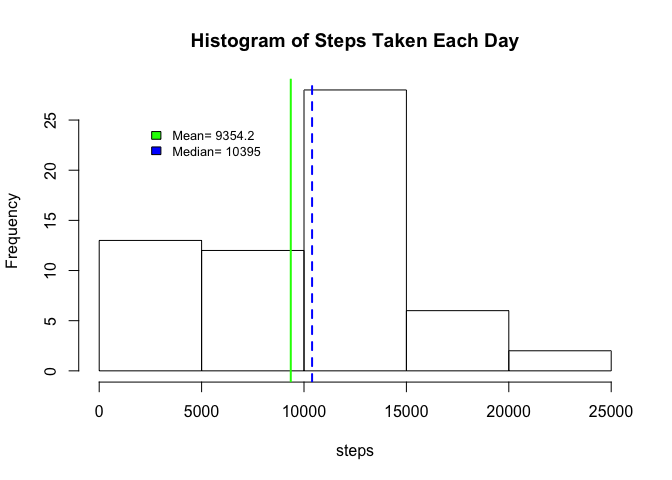
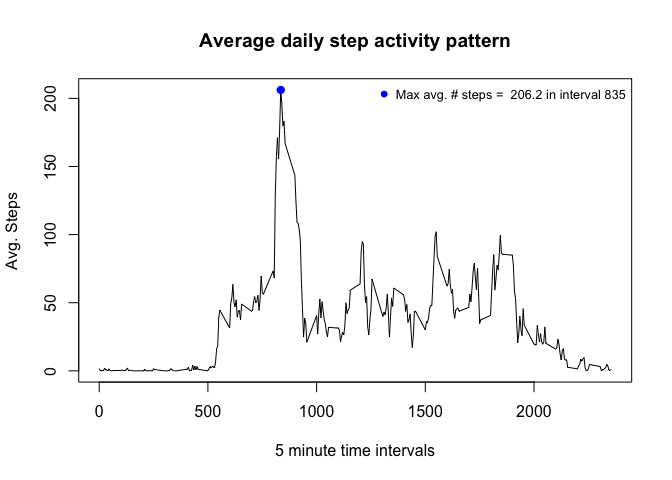
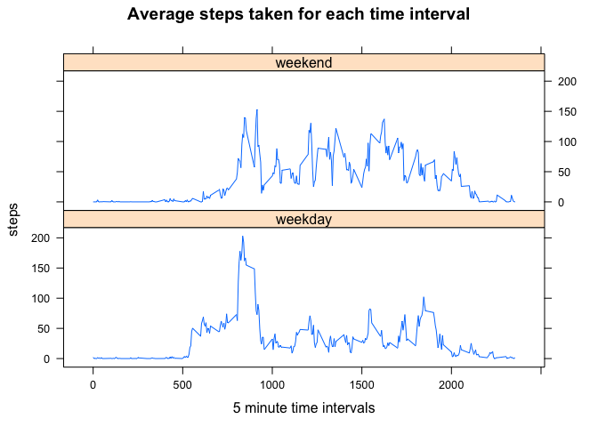

# Reproducible Research: Peer Assessment 1
## Coursera - Reproducible Research, Project 1
Instructions:

1. Code for reading in the dataset and/or processing the data
2. Histogram of the total number of steps taken each day
3. Mean and median number of steps taken each day
4. Time series plot of the average number of steps taken
5. The 5-minute interval that, on average, contains the maximum number of steps
6. Code to describe and show a strategy for imputing missing data
7. Histogram of the total number of steps taken each day after missing values are imputed
8. Panel plot comparing the average number of steps taken per 5-minute interval across weekdays and weekends
9. All of the R code needed to reproduce the results (numbers, plots, etc.) in the report


## Loading and preprocessing the data
The data is contained in the activity.zip file in the course repo, but has been 
cloned and unzipped on my local computer.  It was then read into memory using the 
read.csv function


```r
library(lattice)
setwd("~/rprogramming/ReprodResearch/RepData_PeerAssessment1")
## unzip and read in the the activity file
unzip("activity.zip")
activity <- read.csv("activity.csv")
```

## What is mean total number of steps taken per day?
The sum of steps for each day were calculated using the aggregate function, ignoring NA values.  
A histogram of the data was plotted, with mean and median values indicated 


```r
## Sum the total number of steps for each date
stepsPerDay <- aggregate(activity$steps, by=list(activity$date), "sum", na.rm = TRUE)
colnames(stepsPerDay) <- c("date", "steps")

## Plot a histogram of the steps
par(mar=c(5.1,4.1,4.1,2.1))
with(stepsPerDay, hist(steps, main = "Histogram of Steps Taken Each Day"))

## Calculate mean and median steps per day and add to the current histogram plot
meanSteps <- mean(stepsPerDay$steps, na.rm = TRUE)
abline(v = meanSteps, col = "green", lwd = 2)

medianSteps <- median(stepsPerDay$steps, na.rm = TRUE)
abline(v = medianSteps, col = "blue", lwd = 2, lty = 2)

legend(2000,25, c(paste("Mean=",round(meanSteps,1)), 
                  paste("Median=",round(medianSteps,1))), 
                  fill=c("green", "blue"), bty = "n", cex=0.8)
```

\


## What is the average daily activity pattern?
To show the average activity pattern, the steps for each 5-minute interval were
averaged across all the dates.  The average steps were plotted for each interval.
The maximum average number of steps is 206.2 and is in interval 835.


```r
## Calculate mean of steps taken for each interval, averaged across all dates
stepsPerInterval <- aggregate(activity$steps, by=list(activity$interval), 
                              "mean", na.rm = TRUE)
colnames(stepsPerInterval) <- c("interval", "steps")

## Plot the data
with(stepsPerInterval, plot(interval,steps, type = "l", 
                main = "Average daily step activity pattern",
                xlab = "5 minute time intervals",
                ylab = "Avg. Steps"))

## Calculate the index value for average max # of steps
maxSteps <- which.max(stepsPerInterval$steps)
## Add a point indicating the max average step value
points(stepsPerInterval$interval[maxSteps],stepsPerInterval$steps[maxSteps], 
       pch=19, col = "blue")
legend("topright", paste("Max avg. # steps = ", 
                         round(stepsPerInterval$steps[maxSteps],1),
                         "in interval 835"),
       pch = 19,col ="blue", 
       bty = "n", cex = 0.8)
```

\


## Imputing missing values
In this data set, replacing the NA values could be done several ways.

Two possible approaches were attempted:

* replacing NA values with the mean for the interval, averaged across all days
* replacing NA values with the mean for the day, averaged across all intervals

The second approach was used because generally when NA values were found, all interval step values for the entire days were generally = NA. The resulting histogram plot, mean and media look identical to the earlier plotting exercise


```r
## First calculate the number of missing values for steps
## 2304 missing values out of 17568 observations
missingData = sum(is.na(activity$steps))  
## Create a second data set with imputed values
activityImp <- activity

## For every NA value, replace with the average steps per 5-minute interval for that day

## Calculate the mean steps for every day, removing all NA values
## If the mean for a specific date is NA, then number of steps = 0
meanPerDay <- aggregate(activityImp$steps, by=list(activityImp$date), "mean", na.rm = TRUE)
colnames(meanPerDay) <- c("date", "steps")
## Replace NA values with 0
for(i in 1:nrow(meanPerDay)) {
        if(is.na(meanPerDay$steps[i])) {
                meanPerDay$steps[i] <- 0
        }
}

## If a step value = NA, replace it with the mean value for the day
for(i in 1:nrow(activityImp)) {
        if(is.na(activityImp$steps[i])) {
                activityImp$steps[i] <- meanPerDay$steps[meanPerDay$date == activityImp$date[i]]
        }
}

## As in the earlier histogram plot, the total number of steps for each day is
## calculated from the imputed dataset, and the mean and median is shown.
stepsPerDayImp <- aggregate(activityImp$steps, by=list(activity$date), "sum", na.rm = TRUE)
colnames(stepsPerDayImp) <- c("date", "steps")
with(stepsPerDayImp, hist(steps, main = "Steps Taken Each Day - Imputed"))

abline(v = mean(stepsPerDayImp$steps, na.rm = TRUE), col = "green", lwd = 2)
abline(v = median(stepsPerDayImp$steps, na.rm = TRUE), col = "blue", lwd = 2, lty = 2)

legend(2000,25, c(paste("Mean=",round(mean(stepsPerDayImp$steps, na.rm = TRUE),1)), 
                  paste("Median=",round(median(stepsPerDayImp$steps, na.rm = TRUE),1))), 
       fill=c("green", "blue"), bty = "n", cex=0.8)
```

\


## Are there differences in activity patterns between weekdays and weekends?
To track activity differences between weekdays and weekends, the imputed data
was used, identifying which data was from the "weekend" (Saturday and Sunday),
and which data was from a "weekday" (Monday through Friday).
To visually see the difference, line plots were made with the steps
taken for each 5-minute time interval and averaged across weekdays and weekends.
The plots show differences, notably with weekdays showing a larger spike 


```r
## Add variable to compute day of the week
activityImp$day <- weekdays(as.POSIXlt(activityImp$date))
## Add variable indicating "weekday" or "weekend"
for(i in 1:nrow(activityImp)) {
        if(activityImp$day[i] == "Saturday" | activityImp$day[i] == "Sunday") {
                activityImp$wkday[i] <- "weekend"
        }
        else activityImp$wkday[i] <- "weekday"
}

## Calculate steps averaged per interval, separated across weekend and weekdays
stepsPerInt <- with(activityImp, aggregate(steps, by=list(interval,wkday), 
                                           "mean", na.rm = TRUE))
colnames(stepsPerInt) <- c("interval", "wkday", "steps")
## Panel plot of the data across weekdays and weekends
with(stepsPerInt, xyplot(steps~interval|wkday, type = "l", layout=c(1,2),
                         main="Average steps taken for each time interval",
                         xlab="5 minute time intervals"))
```

\


